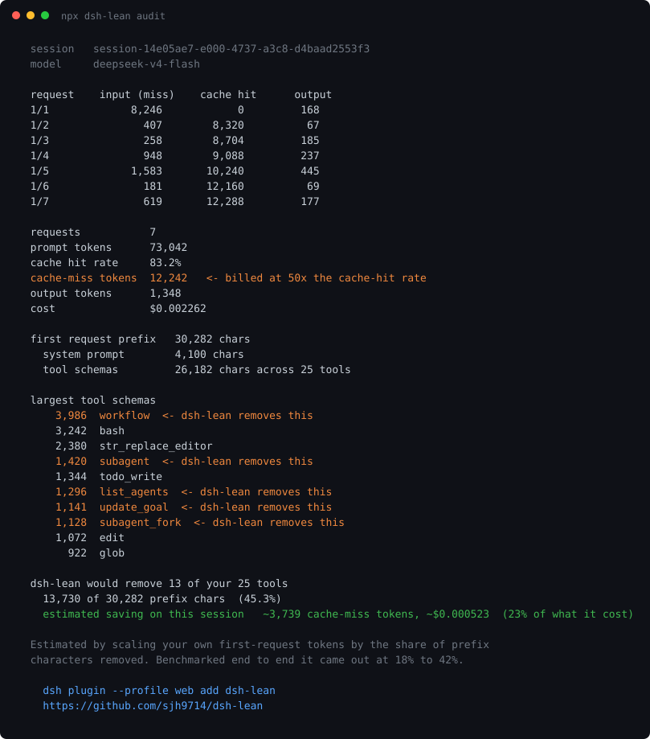

[English](./README.md) | 简体中文

# dsh-lean

[](https://www.npmjs.com/package/dsh-lean)
[](#实测)
[](#实测)
[](#自己复现)
[](./LICENSE)

```sh
npx dsh-lean audit          # 先看你自己的 token 花在哪了，什么都不用装
```



**同样的结果，更小的账单。** 一个 DeepSeek Harness preset，关掉单智能体编码会话根本用不到的工具，把提示词前缀压掉 53%，整场会话省 18% 到 42%。

先跑 audit。它读的是 dsh 本来就写好的会话日志，会列出每个请求的缓存命中拆分、你自己前缀里各个工具 schema 的大小排名，以及这个 preset 在那一场会话上本来能省多少。什么都不装，也没有任何数据离开你的机器。

下面每个数字都来自 DeepSeek API 自己返回的用量统计，产出这些数字的测量脚本就在本仓库里。

## 实测

dsh 0.1.0-rc.6，测于 2026-08-16。共 26 次运行，每次都从任务的干净副本开始。

| 任务 | 请求数 | 默认花费 | dsh-lean 花费 | 省下 | 交付物是否相同 |
|---|---|---|---|---|---|
| 一个问题，不改文件 | 3 | $0.001292 | $0.000755 | **42%** | 无测试可跑 |
| 修好 3 个失败测试 | 6 | $0.002201 | $0.001671 | **24%** | 相同，两边 9 个测试全过 |
| 按 16 个测试实现一个模块 | 4 | $0.002622 | $0.002141 | **18%** | 相同，两边 16 个测试全过 |
| 修好 3 个失败测试，跑在 `deepseek-v4-pro` 上 | 6 | $0.006139 | $0.004906 | **20%** | 相同，两边 9 个测试全过 |

前三行是 `deepseek-v4-flash`，最后一行是同一个任务跑在 `deepseek-v4-pro` 上。百分比落在同一区间，但钱不是。pro 每场省 $0.001233，flash 每场省 $0.000530，同样的改动对付高价的那批人值大约 2.3 倍。

省钱是重点，所以"交付物"这一列必须在。它证明便宜下来不是因为少干了活。每一组配对运行里，测试套件两边都是绿的。

会话第一个请求发出去的前缀。

| | 工具数 | 系统提示词 | 工具 schema | 合计 |
|---|---|---|---|---|
| 默认 | 25 | 4,100 字符 | 27,044 字符 | 31,144 字符 |
| dsh-lean | 12 | 1,853 字符 | 12,875 字符 | **14,728 字符** |

## 为什么能省

DeepSeek 对缓存未命中的输入 token 收费是命中的 **50 倍**，`deepseek-v4-flash` 是每百万 $0.14 对 $0.0028（[价格页](https://api-docs.deepseek.com/quick_start/pricing)，2026-08-16 查阅）。

每场会话的第一个请求，要按未命中价把整个前缀付一遍。在上面那个 6 请求的任务里，仅这一个请求就占了**全部账单的 52%**（3 次运行平均），而且每次都恰好是 8,246 个 token。从第二个请求开始前缀就命中缓存，几乎不要钱。

所以前缀贵不是因为它大，而是因为它被按 50 倍价格付了一次。压缩它，是唯一能碰到账单里真正疼的那部分的杠杆。

关掉一个工具行，系统提示词里为该工具生成的那段说明也会一并消失，所以系统提示词同时缩了 55%。

## 安装

```sh
dsh plugin --profile web add dsh-lean
```

把 `web` 换成你在用的 profile。装完就这样，没有配置文件要改。

直接从仓库装也行，不过上面的 npm 形式更好，预构建的包能跳过 pnpm 的 `allowBuilds` 构建授权步骤。

```sh
dsh plugin --profile web add "github:sjh9714/dsh-lean"
```

卸载。

```sh
dsh plugin --profile web remove dsh-lean
```

## 它关掉了什么

`tool-workflow`、`tool-subagent`、`tool-subagent-fork`、`tool-subagent-control`、`tool-subagent-list-agents`、`tool-subagent-report`、`tool-goal`、`tool-jobs`、`tool-ralph`。

留下的是编码会话真正会用的那些。`bash`、`read`、`write`、`edit`、`glob`、`grep`、`str_replace_editor`、`todo_write`、`skill`、`read_image`、`web_search`、`exit_plan_mode`。

只关工具行。它们背后的服务照常挂载，所以依赖注入这些服务的东西仍然能解析到。

## 什么情况下别用

如果你在用子智能体、workflow、goal 系统、后台 job 或者 ralph 循环，就别装。这些正是它移除的部分，装了以后模型会告诉你没有这个工具。

还有两条要说清楚的限制。

- **会话越长，省得越少。** 它从每场会话开头砍掉的是一个固定量，大约 3,700 个未命中 token。对一次性提问来说这是账单的 42%，对长会话来说就只占一小部分。它不会让一场两小时的会话便宜 42%。
- **在贵的模型上百分比并不会更高。** `deepseek-v4-pro` 的缓存未命中是命中的 120 倍，flash 是 50 倍，所以前缀看起来是更大的靶子。但 pro 的输出单价也是它未命中价的两倍，输出在账单里的占比变大，把大部分好处抵消掉了。实测同一个任务，pro 省 20%，flash 省 24%。变的是省下的绝对金额，不是百分比。

## 自己复现

需要 DeepSeek API key 和 Node 18 以上。

```sh
git clone https://github.com/sjh9714/dsh-lean
cd dsh-lean

# 让基准测试离你自己的 dsh 配置远一点
export DSH_HOME="$PWD/.bench-home"
mkdir -p "$DSH_HOME"
cp ~/.dsh/.credentials.yaml "$DSH_HOME/"

node scripts/run-bench.mjs bench/task-01                             # 默认
node scripts/run-bench.mjs bench/task-01 --patch cordis.patch.yml    # dsh-lean
node scripts/summarize.mjs

# v4-pro 那一行，同样的任务按 120 倍缓存比价
node scripts/run-bench.mjs bench/task-01 --patch bench/pro.patch.yml
node scripts/run-bench.mjs bench/task-01 --patch bench/pro.patch.yml --patch cordis.patch.yml
```

每次运行都会把任务复制到一个全新的工作目录，走 `dsh --profile headless` 跑一遍，用任务自带的 `npm test` 验交付物，然后从 session 日志里把 token 数读回来。表格里每一次运行的原始结果都提交在 `bench/results/` 下。

`npx dsh-lean audit <工作目录>` 可以对你已经跑过的任意 dsh 会话打印同样的拆解，`npx dsh-lean audit --all` 则直接挑你最近的一次会话。

## 测量是怎么做的

dsh 每次运行都会在 `$DSH_HOME/sessions` 下写一个 `session.jsonl.zstd`。两类事件就够了。

- `assistant/chunk` 且 `chunk.type` 为 `usage` 的事件，带着厂商自己给的 `inputTokens`、`cacheReadTokens`、`outputTokens` 和 `reasoningTokens`。
- `request/header` 事件带着实际发出去的完整工具 schema 数组和系统提示词，上面那些前缀尺寸就是这么量出来的，不用额外花一次 API 调用。

`@deepseek-ai/dsh-llm-deepseek` 在记录之前就已经把 DeepSeek 的 `prompt_cache_hit_tokens` 和 `prompt_cache_miss_tokens` 分开了，所以缓存拆分用的是厂商的数字，不是估算。

## 许可

MIT
